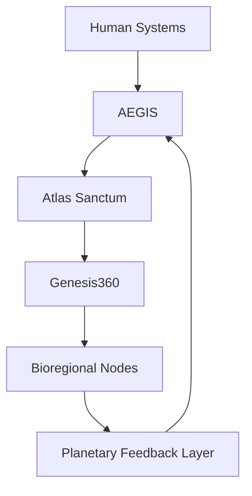
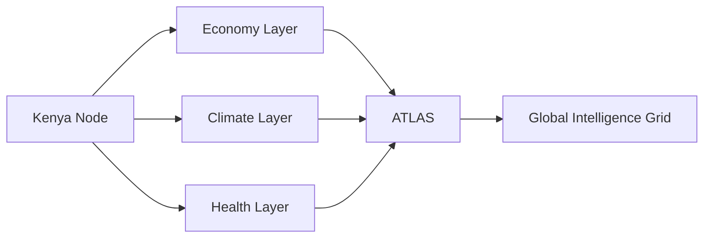

# 🌍⚡ Eugene — Civilizational Systems Architect

<p align="center">
  
</p>

<p align="center">
  
</p>

---

## 🧭 Identity Layer

<p align="center">


</p>

> Building infrastructure where **economics, intelligence, and governance converge into one ethical system layer.**

---

## 🧠 Core Thesis

```text
Modern civilization lacks a unified operating system.

I design the missing layer:

AI → Governance → Finance → Climate → Human Systems
```

---

## 🧬 Flagship Systems

### 🌍 Atlas Sanctum — Regenerative Value Exchange (RVE)

A new class of financial system where **value = measurable planetary impact**

**Core Modules**

* Carbon + ecosystem asset markets
* AI oracle verification layer
* Impact-backed smart contracts
* Cross-system liquidity (fiat + crypto + impact assets)
* Custodian agent networks

> A financial system that rewards regeneration, not extraction.

---

### 🛡️ AEGIS — Ethical Intelligence Layer

A governance-grade AI system for planetary coordination

* Ethical reasoning engines for policy systems
* Public health + infrastructure intelligence
* Real-time civic data dashboards
* AI safety + constraint enforcement layer
* Simulation-based decision forecasting

> AI that does not just compute outcomes — it constrains harm.

---

### 🌱 Genesis360 — Planetary Intelligence OS

A modular data + intelligence infrastructure system

* Climate + health convergence layer
* Impact investment tracking system
* Citizen science + distributed research
* Environmental sensor networks
* Socio-economic real-time mapping

> A living model of planetary state.

---

## 🛰️ System Architecture (High-Level)



---

## 🌐 Bioregional Intelligence Model



---

## 🧩 Technology Stack (Conceptual)

<p align="center">


</p>

---

## 📊 GitHub Intelligence Layer

<p align="center">


</p>

<p align="center">


</p>

<p align="center">


</p>

---

## 🧠 Research Frontiers

* Artificial General Governance Systems (AGGS)
* Regenerative Financial Architecture
* Climate-finance convergence systems
* AI constitutional frameworks
* Bioregional operating systems
* Civilization-scale simulation models
* Ethical constraint-based AI design

---

## ⚙️ Current Execution Layer

```yaml
focus:
  - Atlas Sanctum scaling architecture
  - AI-native financial systems design
  - Bioregional intelligence mapping (Africa-first)
  - Governance AI constraint systems
  - Real-world impact tokenization models
```

---

## 🌍 Design Philosophy

<p align="center">
  
</p>

---

## 🧭 System Mental Model

```text
Old World: Extract → Consume → Optimize Profit

New World: Measure → Regenerate → Align Incentives → Evolve Systems
```

---

## 🤝 Collaboration Signal

<p align="center">


</p>

---

## 🔭 Closing Statement

> The goal is not to build better software.
> The goal is to build **better systems for civilization itself.**

---

Just
