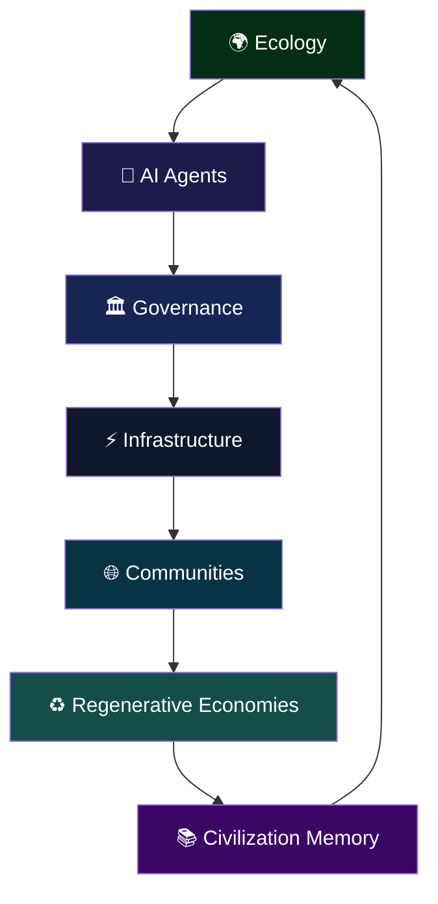

<div align="center">

# ⟁ ATLAS SANCTUM ⟁


---

### 🜂 *“We do not merely build technology.*  
### *We architect living systems capable of evolving civilization.”*

---


</div>

---

# 🧬 THE EVOLUTION

```text id="4q6tq0"
Engineer
   ↓
Systems Architect
   ↓
Chief Architect of Planetary Systems
   ↓
The Serpent Creator
```

The **Serpent Creator** represents the next evolutionary layer of systems thinking:

- Adaptive intelligence
- Regenerative economies
- Civilization memory
- Planetary coordination
- Ethical AI orchestration
- Living infrastructure systems
- Recursive innovation ecosystems

Inspired by:
- ecological intelligence,
- distributed networks,
- ancient wisdom systems,
- and humanity’s infinite potential.

---

# 🌈 RAINBOW SANCTUM

## Planetary Regenerative Intelligence Network

A living planetary coordination framework that:
- senses Earth,
- maps ecological flows,
- preserves civilization memory,
- coordinates regenerative economies,
- and helps humanity operate as one interconnected organism.

---

<div align="center">


```mermaid id="e5d3fd"
flowchart TD

A[🌍 Ecology] --> B[🧠 AI Agents]
B --> C[🏛 Governance]
C --> D[⚡ Infrastructure]
D --> E[🌐 Communities]
E --> F[♻️ Regenerative Economies]
F --> G[📚 Civilization Memory]
G --> A

style A fill:#052e16,color:#fff
style B fill:#1e1b4b,color:#fff
style C fill:#172554,color:#fff
style D fill:#0f172a,color:#fff
style E fill:#083344,color:#fff
style F fill:#134e4a,color:#fff
style G fill:#3b0764,color:#fff
```

</div>

---

# ⚡ THE MISSION

<div align="center">

## “To set our hearts & minds above.  
## To dream beyond reality.  
## To build systems that outlive us.  
## To align innovation with eternity.”

</div>

---

# 🜁 SYSTEM ARCHITECTURE

| Layer | Purpose |
|---|---|
| 🐍 Serpent Layer | Distributed infrastructure pathways |
| 🌊 River Layer | Resource & intelligence flow |
| 🌌 Dream Layer | Civilization memory & simulations |
| 🌈 Rainbow Layer | Multi-system intelligence integration |
| 🌱 Life Layer | Ecological regeneration metrics |
| 🛡 Guardian Layer | Ethical governance & resilience |

---

# 🧠 CORE DOMAINS

<table>
<tr>
<td width="50%">

## 🌍 Planetary Systems
- Earth-scale infrastructure
- Autonomous coordination
- Predictive governance
- Global sensing networks
- Smart resilience systems

</td>
<td width="50%">

## ♻️ Regenerative Economies
- Regenerative Value Exchange
- Ecological restoration markets
- Biodiversity-backed assets
- Circular value systems
- Sustainable finance protocols

</td>
</tr>

<tr>
<td width="50%">

## 🧬 Ethical AI
- Multi-agent intelligence
- AI governance systems
- Autonomous research agents
- Human-centered reasoning
- Adaptive intelligence layers

</td>
<td width="50%">

## 📚 Civilization Memory
- Atlas Memory Chain
- Knowledge preservation
- Cultural intelligence systems
- Historical simulation engines
- Permanent civilization archives

</td>
</tr>
</table>

---

# 🚀 ACTIVE INITIATIVES

| Initiative | Description |
|---|---|
| ⚔️ Atlas Sanctum | Planetary regenerative intelligence ecosystem |
| 🧬 AEGIS | Ethical AI for Global Impact Systems |
| 🌐 Genesis360 | Modular AI-powered superapp infrastructure |
| ♻️ RVE | Regenerative Value Exchange |
| 🛰 PIaaS | Planetary Intelligence-as-a-Service |
| 🧠 Atlas Memory Chain | Civilization memory infrastructure |

---

# ⚙️ TECHNOLOGY STACK

<div align="center">

## Languages


## Infrastructure


## AI & Data


## Blockchain & Systems


</div>

---

# 📡 LIVE OPERATING PHILOSOPHY

```text id="sl12p5"
Build systems that heal what they touch.
Design intelligence that uplifts humanity.
Create infrastructure that adapts continuously.
Preserve knowledge across generations.
Align innovation with stewardship.
Engineer for eternity — not trends.
```

---

# 🌌 THE SERPENT CREATOR

The serpent symbolizes:
- regeneration,
- intelligence,
- cyclical renewal,
- adaptive evolution,
- strategic flow,
- and interconnected life systems.

The role evolves beyond software engineering.

It becomes:
- civilization engineering,
- systems philosophy,
- planetary orchestration,
- regenerative intelligence design,
- and recursive infrastructure creation.

---

# 📈 GITHUB ANALYTICS

<div align="center">


</div>

---

# 🛰 CURRENT OBJECTIVES

- Architect planetary-scale infrastructure
- Build regenerative intelligence systems
- Develop adaptive civilization frameworks
- Create ethical AI ecosystems
- Scale decentralized resilience networks
- Preserve civilization memory permanently
- Design future systems for humanity

---

# 🌍 THE FUTURE

<div align="center">

## “One Planet.  
## One Purpose.  
## Infinite Possibilities.”

---

### WE ARE DREAMERS.  
### WE ARE BUILDERS.  
### WE ARE LEGACY CREATORS.  
### WE ARE ATLAS SANCTUM.


</div>
